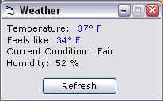



## Weather\.com Parser \(working\)

### Description

Retrieves weather page from Weather.com and parses the info (temp, feels like temp, humidity, and current conditions). Puts it all in a nice little form. Self explanatory, dont email me cause you wont get a response.
 
### More Info
 

             |
---                |---
**Submitted On**   |2002-01-16 19:31:44
**By**             |[James Balducci](https://github.com/Planet-Source-Code/PSCIndex/blob/master/ByAuthor/james-balducci.md)
**Level**          |Beginner
**User Rating**    |4.3 (17 globes from 4 users)
**Compatibility**  |VB 5\.0, VB 6\.0
**Category**       |[Internet/ HTML](https://github.com/Planet-Source-Code/PSCIndex/blob/master/ByCategory/internet-html__1-34.md)
**World**          |[Visual Basic](https://github.com/Planet-Source-Code/PSCIndex/blob/master/ByWorld/visual-basic.md)
**Archive File**   |[Weather\_co491611162002\.zip](https://github.com/Planet-Source-Code/james-balducci-weather-com-parser-working__1-30867/archive/master.zip)

